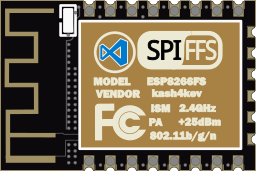
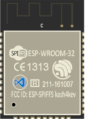

# Visual Studio Code extension for ESP8266/ESP32 File System (SPIFFS/LITTLEFS)

> **Note:** This extension is under development\
> **Note:** ESPFS extension is only a mod from [original extension by kash4kev](https://github.com/kash4kev/vscode-esp8266fs)

&nbsp;&nbsp;&nbsp;&nbsp;&nbsp;&nbsp;

Added: LittleFS pack, list and upload\
Added: LittleFS pack and upload ESP32\
Renamed: ESP8266FS to ESPFS\
Removed: Unpack, visualize

New keywords:\
espfs.mklittlefs.debugLevel\
espfs.mklittlefs.executable e.g. "c:/arduino/tools/mklittlefs.exe"\
espfs.littlefsImage e.g. "(path)/(Name).mklittlefs.bin"\
espfs.mklittlefs.allFiles\

mklittlefs.exe <https://github.com/earlephilhower/mklittlefs>

Welcome to the Visual Studio extension for the **ESP8266/ESP32 File System SPIFFS/LITTLEFS**.

Whereas the **Arduino IDE** versions adds menu items to the IDE (*Tools/ESP??? Sketch Data Updoad*), VSCode provides no such mechanism.  Instead, this extension implements a VSCode command (`ESPFS: Upload LittleFS`) to perform the same task.

While this extension really doesn't need the **Arduino IDE** installed - it only needs the ESP8266 or ESP32 package and tools - it's best to have it installed anyway.  This extension is meant to be a companion extension for the [Arduino for Visual Studio Code](https://github.com/Microsoft/vscode-arduino) plugin, which relies on the **Arduino IDE** to compile and upload code through their toolchain.

## Features

* Works with or without the **Arduino for Visual Studio Code** plugin installed.  Just needs [**mkspiffs**](https://github.com/igrr/mkspiffs), [**esptool**](https://github.com/igrr/esptool-ck) or [**esptool.py**](https://github.com/espressif/esptool), and [**espota.py**](https://github.com/esp8266/Arduino/blob/master/tools/espota.py) (if using OTA updating).
* Implements VSCode commands to:
  * upload,
  * pack,
  * list
* Uses settings from:
  * **.vscode/arduino.json**,
  * **settings.json**
  * or **...arduino.../preferences.txt**.
* Overrides available for all toolchain settings in the **settings.json** file.

## Requirements

The [ESP8266 core for Arduino](https://github.com/esp8266/Arduino) or [ESP32 core for Ardiuno](https://github.com/espressif/arduino-esp32) needs to be installed on your computer.

* For the ESP8266, it is best to use the [Arduino IDE](https://www.arduino.cc/en/Main/Software)'s Board Manager (*Tools/Board/Board Manager...*) or use the [Arduino for Visual Studio Code](https://github.com/Microsoft/vscode-arduino)'s `Arduino: Board Manager` command.
* For the ESP32, follow the instructions in their [**README.md**](https://github.com/espressif/arduino-esp32/blob/master/README.md) for the relevant OS.

If you manually install the package, you can still use this extension by setting the overrides.

## ESP8266 vs. ESP32

Without getting in the differences between the two processors, their Arduino development environments are install in two different locations, through two different methods.

The toolchains for the two are similar, but slightly different.  To upload files the **ESP8266** uses a compile tool called **esptool** and **ESP32** uses a python-based program called **esptool.py**, and the command-line arguments for the two are completely different.

Finally, the **boards.txt** found in both locations use different settings for the same item.  The **EPS32** uses a "partitions" directory with CSV files to describe the memory layouts of the flash.

| Chip    | OS      | Package Location                                                            | Esptool     | Version |  MkSpiffs |
| ------- | ------- | --------------------------------------------------------------------------- | ----------- | ------- | --------- |
| ESP8266 | Windows | C:\Users\X\AppData\Local\Arduino15\\esp8266\hardware\esp8266\2.4.1          | esptool.exe | 0.4.13  |   0.2.0   |
|         | Mac     | ~/Library/Arduino15/packages/esp8266/hardware/esp8266/2.4.1                 | esptool     |         |           |
|         | Linux   | ~/.arduino15/packages/esp8266/hardware/esp8266/2.4.1                        | esptool     |         |           |
| ESP32   | Windows | C:\Users\X\Documents\Arduino\hardware\espressif\esp32                       | esptool.py  |         |   0.2.2   |
|         | Mac     | ~/Documents/Arduino/hardware/espressif/esp32                                | esptool.py  |         |           |
|         | Linux   | ~/Arduino/hardware/espressif/esp32                                          | esptool.py  |         |           |

## Installation

Open VS Code and press `F1` or `Ctrl+Shift+P` to open command palette, select **Install Extension** and type `ESPFS`.

You can also install directly from the Marketplace within Visual Studio Code: search for `ESPFS`.

## Getting Started

After installing this extension, you need to:

1. Create a new VSCode Project via the **Arduino for Visual Studio Code** extension (Command: `Arduino: Initialize`) or a new sketch with the **Arduino IDE** (`File/New`).

1. Add the URL **[http://arduino.esp8266.com/stable/package_esp8266com_index.json](http://arduino.esp8266.com/stable/package_esp8266com_index.json)** to the Additional Board URL settings.

1. Either:

    a. Install the **ESP8266** board from the Board Manager: (VSCode: `Arduino: Board Manager`, or IDE: `Tools/Board/Board Manager...`).

    b. Install the **ESP32** board using the instructions in their [**README.md**](https://github.com/espressif/arduino-esp32/blob/master/README.md).

1. Select an **ESP8266/ESP32** board as the target development board.

1. Create and populate a directory with the files to be uploaded to the target partition

1. Set the `espfs.dataFiles` setting to point the base directory of the files that will be uploaded.  If the default directory **./data** is used, this setting can be ignored.

1. Optionally - Set the `espfs.littlefsImage` setting to a filename that **mklitlefs** will create.

1. Done - you can now run the commands provided by this extension on the `espfs.dataFiles` and `espfs.littlefsImage`.

---

## Commands

All of the commands send their spew to the ESP8266FS OUTPUT window.  The amount of spew is dictated by the `logLevel`.  Setting it to "debug" will send more spew back to the hosting debugger and has no effect on using the extension.

| Name                                    | Command id                  | Description                                  |
| --------------------------------------- |:--------------------------- |:-------------------------------------------- |
| `ESPFS: Upload LITTLEFS`              | *espfs.uploadLittlefs*    | Upload a LITTLEFS image.                       |
| `ESPFS: Pack LITTLEFS`                | *espfs.packLittlefs*      | Creates the LITTLEFS image.                    |
| `ESPFS: List LITTLEFS`                | *espfs.listLittlefs*      | List the contents of a LITTLEFS image.         |
| `ESPFS: Upload SPIFFS`              | *espfs.uploadSpiffs*    | Upload a SPIFFS image.                       |
| `ESPFS: Pack SPIFFS`                | *espfs.packSpiffs*      | Creates the SPIFFS image.                    |
| `ESPFS: List SPIFFS`                | *espfs.listSpiffs*      | List the contents of a SPIFFS image.         |

### Upload

`ESPFS: Upload LITTLEFS` - This command sends the `espfs.littlefsImage` to the **ESP8266** using the **esptool**, **epstool.py** or **espota.py** tool (depending on the output port or target chip).

### Pack

`ESPFS: Pack LITTLEFS` - this command packs all of the files in the `espfs.dataFiles` subdirectory using the **mkslittlefs** tool into the `espfs.littlefsImage` file.

### List

`ESPFS: List LITTLEFS` - this command will list the contents  of the `espfs.littlefsImage` using the **mklittlefs** tool.

## Options

The following Visual Studio Code settings are available for the **ESPFS** extension. These can be set in the global user preferences `Ctrl+,` or workspace settings (.vscode/settings.json). The later overrides the former. None of these settings are necessary as all have default values, or are deduced from the environment.

## *`.vscode/settings.json`*

```json
{
    ...

        //--- Python path - needed for espOTA.py

    "python.pythonPath": "C:/Python34/python.exe",

        //--- ESP8266FS for Visual Studio Code settings

    "espfs.dataFiles": "./data",
    "espfs.preferencesPath": "C:/Users/X/AppData/Local/Arduino15",
    "espfs.arduinoUserPath": "C:/Users/X/Documents/Arduino",
    "espfs.littlefsImage": "./temp/littlefs.image.bin",
    "espfs.logLevel": "normal",

    "espfs.mklittlefs.executable": "C:/Users/X/AppData/Local/Arduino15/packages/esp8266/tools/mkspiffs/0.2.0/mkspiffs.exe",
    "espfs.mklittlefs.debugLevel": "0",
    "espfs.mklittlefs.allFiles": true,

    "espfs.esptool.executable": "C:/Users/X/AppData/Local/Arduino15/packages/esp8266/tools/esptool/0.4.12/esptool.exe",
    "espfs.esptool.verbosity": "vvv",

    "espfs.esptool.py.before": "default_reset",
    "espfs.esptool.py.after": "hard_reset",
    "espfs.esptool.py.no_stub": "false",
    "espfs.esptool.py.trace": "false",
    "esptool.py.spi_connection": "SPI",
    "esptool.py.compress": "true",
    "esptool.py.verify": "false",

    "espfs.espota.py": "C:/Users/X/AppData/Local/Arduino15/packages/esp8266/hardware/esp8266/2.4.0/espota.py",
    "espfs.espota.esp.port": 8266,
    "espfs.espota.host.ip": "0.0.0.0",
    "espfs.espota.host.port": 12345,
    "espfs.espota.debug": true,

    ...
}
```

### vscode

* `python.pythonPath` - Path to the **python** executable; as defined by the VSCode Python Environment. Can be set via the `Python: Select Interpreter` command.  If not specified, then "**python**" will be used.  Only needed if using OTA (espota.py).

### ESPFS

* `"espfs.dataFiles` - Location of the base directory of the files to be uploaded to the ESP8266's SPIFFS.  File names will be generated relative to this path.  Default is "**./data**".

* `"espfs.preferencesPath` - Location of the **Arduino IDE**'s "preferences.txt" file and installed libraries.  This value does not need to be set, but exists to override the default location.

* `"espfs.spiffsImage` - Name of the packed **SPIFFS** image.  Default is "**./spiffs.image**".

* `"espfs.logLevel` - Changes the amount of spew produced.  Set to either `normal`, `verbose`, `silent`, or `debug`. Default is **normal**.

### mkspiffs

* `"espfs.mkspiffs.executable` - Path to **mkspiffs** executable.  If not specified, then ESP8266FS will attempt to locate it through the Arduino settings.

* `"espfs.mkspiffs.debugLevel` - Debug spew level for **mkspiffs**.  Default is **0**.

* `"espfs.mkspiffs.allFiles` - Tells **mkspiffs** to include ignored files (*.DS_Store* and *.git* directories).  Default is **false**.

### esptool

* `"espfs.esptool.executable` - Path to **esptool** executable.  If not specified, then ESP8266FS will attempt to locate it through the Arduino settings.

* `"espfs.esptool.verbosity` - **esptool** verbosity.  Add more **v**'s to be more verbose.  Default is no **v**'s.

### esptool.py

* `esptool.py.before` - "What to do before connecting to the chip".

* `esptool.py.after` - "What to do after esptool.py is finished".

* `esptool.py.no_stub` - "Disable launching the flasher stub, only talk to ROM".

* `esptool.py.trace` - "Enable trace-level output of esptool.py interactions".

* `esptool.py.spi_connection` - "Override default SPI Flash connection. Value can be SPI, HSPI or a comma-separated list of 5 I/O numbers to use for SPI flash (CLK,Q,D,HD,CS)".

* `esptool.py.compress` - "Compress data in transfer (default "true" unless "no-stub" is specified)".

* `esptool.py.verify` - "Verify just-written data on flash (mostly superfluous, data is read back during flashing)".

### espota

* `"espfs.espota.py` - Path to the **espota** python script.  If not specified, then ESP8266FS will attempt to locate it through the Arduino settings.

* `"espfs.espota.esp.port` - IP port for the target **ESP8266**.  Default is **8266**.

* `"espfs.espota.host.ip` - IP address for the host.  Default is "**0.0.0.0**".

* `"espfs.espota.host.port` - IP port for the host.  Default is a random port: 10000-60000.

* `"espfs.espota.auth` - Authentication password for the **espota** python script.  Default is not set.

* `"espfs.espota.debug` - Enables debug output from the **espota** python script.  Default is **false**.

## *`.vscode/arduino.json`*

The following settings are per sketch settings (*defined by the **Arduino for Visual Studio Code** plugin).  You can find them in `.vscode/arduino.json` in the workspace.  The `.vscode/arduino.json` file has "per sketch" settings.

```json
{
    "port": "COM6",
    "board": "esp8266:esp8266:generic",
    "configuration": "...FlashSize=4M3M,...ResetMethod=ck,..."
}
```

* `port` - Name of the serial port connected to the device. Can be set by the `Arduino: Select Serial Port` command.  Alternatively, if you specify an IP address (x.x.x.x), then the `espota.py` script will be executed to communicate with the ESP8266 (**OTA** = **O**ver **T**he **A**ir).

* `board` - Current selected Arduino board alias. Can be set by the `Arduino: Change Board Type` command. Also, you can find the board list there.
* `configuration` - (*Undocumented*) A comma-delimited string of the configuration settings selected for all board "menu" items.  **ESP8266FS** relies on four key/value pairs in the string: `FlashSize`, `FlashMode`, `FlashFreq` and `ResetMethod`.

Alternatively, if the `.vscode/arduino.json` file doesn't exist, or a particular setting is not defined, then the settings in the **Arduino IDE**'s `preferences.txt` file will be used instead.  This file is generated by the **Arduino IDE** and is set globally for ALL sketches.

## *`preferences.txt`*

```ini
board=generic
target_package=esp8266
target_platform=esp8266

serial.port=COM6

custom_FlashSize=generic_4M3M
custom_ResetMethod=generic_ck
```

---

## Known Issues

## Release Notes

## [0.0.1] 2025-02-06

* Initial release - out for review.

## License

This extension is licensed under the [MIT License](https://github.com/Microsoft/vscode-esp8266fs/blob/master/LICENSE.txt).
